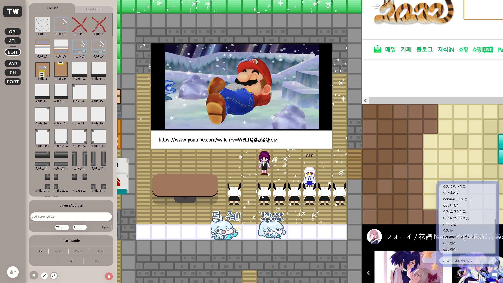

# The World Front

This is the front project of The World, a 2D top-down metaverse platform project.

you can play our service on https://the-world.space

## Used Stacks

- [TypeScript](https://www.typescriptlang.org/) - used programming language
- [React](https://reactjs.org/) - for page and in game GUI
- [Styled Components](https://styled-components.com/) - for page and in game GUI
- [Graph QL](https://graphql.org/) - for networking with server over web socket
- [the-world-engine.ts](https://github.com/The-World-Space/the-world-engine.ts) - for render game view
